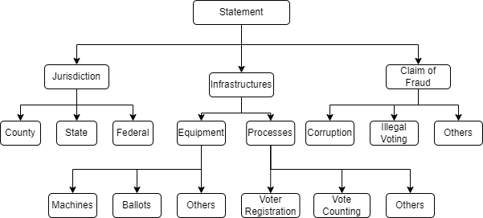

ElectAI
=======

Taxonomy
--------



Datasets
--------

The dataset folder contains two subfolders.

*   claim understanding: This benchmark dataset is annotated based on the taxonomy. The file 'claims-annotated.csv' contains the following columns:
    1.  tweet: the human or LLM-generated tweet.
    2.  Jurisdiction: incdicates if election jurisdiction is specified.
    3.  Jurisdiction - State: indicates if state level jursidiction.
    4.  Jurisdiction - County: indicates if county level jursidiction.
    5.  Jurisdiction - federal: indicates if federal elections are mentioned.
    6.  Equipment: indicates if election equipments are mentioned.
    7.  Equipment - Machines: indicates if the tweet mentions voting machines.
    8.  Equipment - Ballots: indicates if the tweet mentions ballots.
    9.  Processes: indicates if the tweet mentions any election process.
    10.  Processes - Vote Counting: indicates if the tweet mentions vote counting process.
    11.  Claim of Fraud: indicates if the tweet has a claim of fraud.
    12.  Claim of Fraud - Corruption: indicates if the claim is related to corruption.
    13.  Claim of Fraud - Illegal Voting: indicates if the claim is related to illegal voting.
  
*   authorship attribution: This folder contains train (train.csv) and test(test.csv) files for the authorship attribution task. The files contain the following columns:
    1.  tweet: the human or LLM-generated tweet.
    2.  label: the label denoting the human/LLM used to generate the tweet.

Code
----

The datasets and code can be accessed through the following link: [Datasets](https://github.com/LanguageTechnologyLab/ElectAI)

All the scripts are implemented using python.  
  

### Installation

Clone the repository from github using the link above as follows:
```
git clone https://github.com/LanguageTechnologyLab/ElectAI.git
```
Navigate to the GenOffense directory and install the required packages
```
cd ElectAI
pip install -r requirements.txt
```
### Accessing Data

The files are a '.csv' files. The columns are tab separated. These file can be loaded in python using the pandas library as follows.
```
import pandas
pandas.read\_csv(filename, sep="\\t")
```
### Claim Understanding

To evaluate an LLM for claim understanding, use the following command. You need to specify the name of the model.
```
python incontext.py MODEL\_NAME
```
MODEL\_NAME can be _llama_, _falcon_, _mistral_, _flan_

### Authorship Attribution

To train/fine-tune a model for classification, run the following command. You must specify the name of the model. In case of Random forest, specify the features to be used
```
python trainer.py MODEL\_NAME FEATURE\_NAME
```
MODEL\_NAME can be _bert_, _roberta_, _rf_

FEATURE\_NAME can be _tfidf_, _word2vec_
